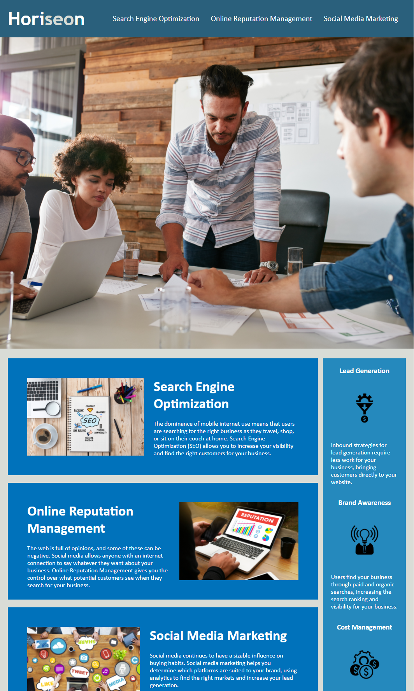

# Horiseon!

## Description
This project is for Horiseon Social Solution Services. It provides easy access to their descriptions of the services they provide. As well as the benifits of
using Horiseon. `index.html` and `style.css` were the only applications need for this project.

### What I achieved 
* Cleaned up sytle.css, making it more simple and shorter
* Eliminated all `
` tags by adding semantic tags
* Added comments in the CSS in order to understand its purpose \
* Added a title to the page
* Added `alt` attributes into all the `` tags

